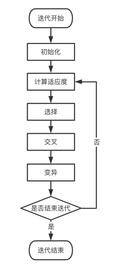
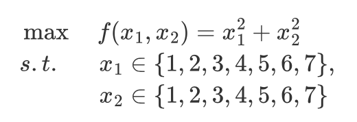
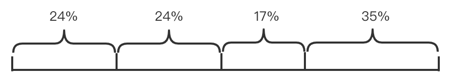
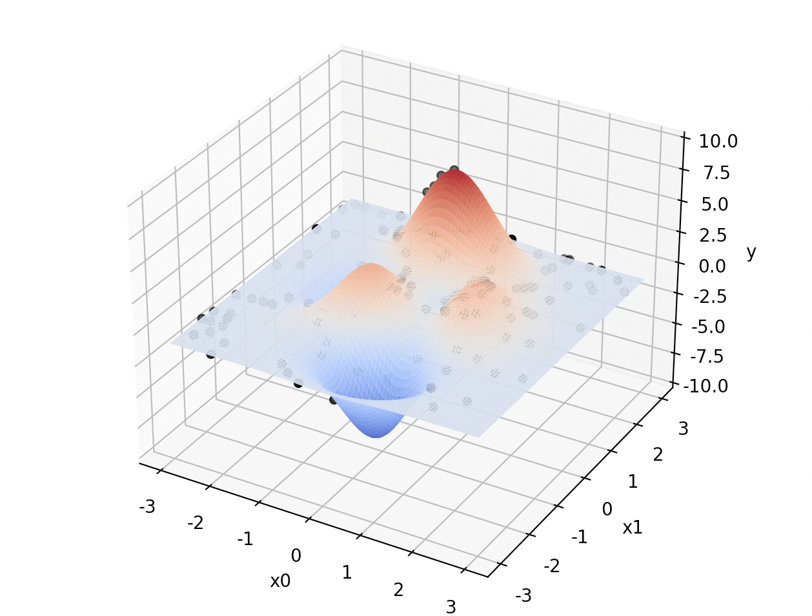
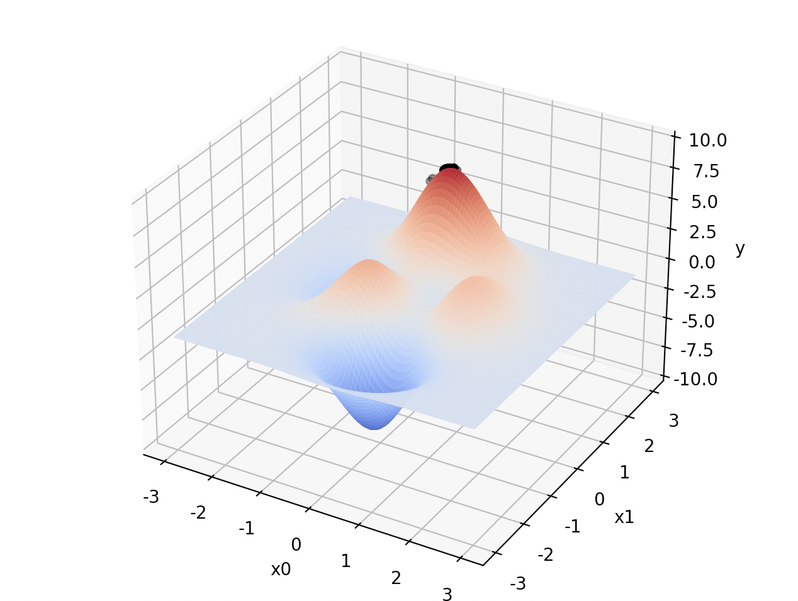

# 目录

* [目录](#目录)
* [项目介绍](#项目介绍)
* [算法介绍](#算法介绍)
   * [蚁群算法](#蚁群算法)
      * [一、什么是蚁群算法](#一什么是蚁群算法)
      * [二、蚁群算法流程图和基本原理介绍](#二蚁群算法流程图和基本原理介绍)
      * [三、示例](#三示例)
   * [遗传算法](#遗传算法)
      * [一、什么是遗传算法](#一什么是遗传算法)
      * [二、遗传算法框图和原理介绍](#二遗传算法框图和原理介绍)
      * [三、遗传算法的几个基本概念](#三遗传算法的几个基本概念)
      * [四、示例](#四示例)
* [代码结构](#代码结构)
* [运行方式](#运行方式)
   * [蚁群算法](#蚁群算法-1)
   * [遗传算法](#遗传算法-1)
* [运行结果](#运行结果)
   * [蚁群算法](#蚁群算法-2)
   * [遗传算法](#遗传算法-2)
* [算法分析](#算法分析)
   * [蚁群算法](#蚁群算法-3)
   * [遗传算法](#遗传算法-3)
      * [优缺点](#优缺点)
      * [时间复杂度](#时间复杂度)
* [应用](#应用)
   * [蚁群算法](#蚁群算法-4)
   * [遗传算法](#遗传算法-4)

# 项目介绍

介绍两种智能算法：蚁群算法和遗传算法，并提供可运行的示例程序

# 算法介绍

## 蚁群算法

### 一、什么是蚁群算法
蚁群算法是一种源于大自然生物世界的新的仿生进化算法，由意大利学者M. Dorigo，V. Maniezzo和A. Colorni等人于20世纪90年代初期通过模拟自然界中蚂蚁集体寻径行为而提出的一种基于种群的启发式随机搜索算法。蚂蚁有能力在没有任何提示的情形下找到从巢穴到食物源的最短路径，并且能随环境的变化，适应性地搜索新的路径，产生新的选择。其根本原因是蚂蚁在寻找食物时，能在其走过的路径上释放一种特殊的分泌物——信息素（也称外激素），随着时间的推移该物质会逐渐挥发，后来的蚂蚁选择该路径的概率与当时这条路径上信息素的强度成正比。当一条路径上通过的蚂蚁越来越多时，其留下的信息素也越来越多，后来蚂蚁选择该路径的概率也就越高，从而更增加了该路径上的信息素强度。而强度大的信息素会吸引更多的蚂蚁，从而形成一种正反馈机制。通过这种正反馈机制，蚂蚁最终可以发现最短路径。

### 二、蚁群算法流程图和基本原理介绍
#### 蚁群算法流程图
image_1
#### 蚁群算法基本原理介绍
im_1
im_2
im_3
### 三、示例
 为了简化计算量，本示例城市数b=4,蚂蚁数m=3
 
 四个城市分别为A,B,C,D,城市间距离矩阵dis以及城市地图如下：
 city_im
 dis_im
 
 我们假设算法参数如下：
 paras_im
 
 步骤1. 初始化信息素矩阵τ(0)
 τ(0)_
 
 步骤2. 将只蚂蚁随机投放到n个城市，假设ant_1出发城市是A,ant_2出发城市是B,ant_3出发城市是D。
 
 步骤3.1 为3只蚂蚁选择下一个城市，仅以ant_1为例，因为当前ant_1在城市i=A，所以ant_1的禁忌表tabu(ant_1)={A}。
      分别计算ant_1访问禁忌表外的城市{B,C,D}的概率，如下：
      A_im
      使用轮盘赌法选择下一个访问的城市。假如轮盘赌法使ant_1选择城市B。
      使用同样方法可计算其他蚂蚁，假设ant_2选择城市D,ant_3选择城市A。
      
步骤3.2 为每只蚂蚁选择下一个要去的城市，仅以ant_1为例，因为当前ant_1在城市i=B，所以ant_1的禁忌表tabu(ant_1)={A,B}。
      分别计算ant_1访问禁忌表外的城市{C,D}的概率，如下：
      B_im
      使用轮盘赌法选择下一个访问的城市。假如轮盘赌法使ant_1选择城市D。
      使用同样方法可计算其他蚂蚁，假设ant_2选择城市C,ant_3选择城市C。
      
步骤3.3 到此，tabu(ant_1)={A,B,D}，ant_1访问禁忌表外的城市{C}，所以只能选择城市A。同样其他蚂蚁将进行最后一个城市的游走。
       本次迭代结束后，三只蚂蚁走过城市的顺序即各自tabu集合里的城市顺序，如下：
       tabu(ant_1)={A,B,D,C}
       tabu(ant_2)={B,D,C,A}
       tabu(ant_3)={D,A,C,B}
       
步骤4. 根据tabu分别计算3只蚂蚁走过的路径长度len(k)，如下：
      len(ant_1)=3+4+2+1=10
      len(ant_2)=4+2+1+3=10
      len(ant_3)=2+1+5+4=12
      比较3只蚂蚁的路径长度，更新最短路径short_path=tabu(ant_1)或tabu(ant_2)
      更新每条边上的信息素，如下：
      τ_im
      
步骤5. 如果满足结束条件，输出最短路径和路径长度，否则，转向步骤2继续执行。
       
## 遗传算法

### 一、什么是遗传算法
遗传算法（Genetic Algorithm, GA）是模拟达尔文生物进化论的自然选择和遗传学机理的生物进化过程的计算模型，是一种通过模拟自然进化过程搜索最优解的方法。
其主要特点是直接对结构对象进行操作，不存在求导和函数连续性的限定；具有内在的隐并行性和更好的全局寻优能力；采用概率化的寻优方法，不需要确定的规则就能自动获取和指导优化的搜索空间，自适应地调整搜索方向。
遗传算法以一种群体中的所有个体为对象，并利用随机化技术指导对一个被编码的参数空间进行高效搜索。其中，选择、交叉和变异构成了遗传算法的遗传操作；参数编码、初始群体的设定、适应度函数的设计、遗传操作设计、控制参数设定五个要素组成了遗传算法的核心内容。

遗传算法能够自我迭代，让它本身系统内的东西进行优胜劣汰的自然选择，把好的保留下来，次一点的东西就排除掉。遗传算法的本质就是是优胜劣汰，选出最优秀的个体，一般用来寻找最优解。
### 二、遗传算法框图和原理介绍
一次迭代包括以下几个过程：

* 计算适应度: 计算每个染色体在当前迭代下对应的适应度
* 优胜劣汰选择: 选出下一代的染色体
* 染色体交叉: 任意选择两个染色体交换部分基因
* 染色体变异: 即改变某个染色体的值
  




### 三、遗传算法的几个基本概念

1. 种群

   首先，既然是遗传，寻找最优解，可以理解成找到最好的一个个体，那就得在一定的个体中去实现。这些所有的个体就构成了一个种群。实际问题中就是要求解的函数的自变量。

2. 个体

   在一个种群中，有若干的个体，他们有着不同的特征。为自变量的值，是当前求解问题的解，一般使用二进制编码表示。

3. 染色体

   一个个体对应一个染色体，染色体是个体基因的总称。染色体包含基因

4. 基因

   一个个体对应一个染色体，但是可以有多个基因。实际问题中，每个染色体使用二进制编码表示，基因就对应二进制中的0和1。

5. 适应度

   一个个体在基因确定的情况下，它的适应度就确定了。适应度就是自变量对应的函数值。

6. 交叉

   染色体的交叉：N个染色体中，任意两个可能会交换染色体的某一部分基因。以一定概率通过互换两个父代个体的部分染色体产生新个体的运算。交叉运算是遗传算法核心算法之一，该算法在遗传过程中使用的频率最高，其目的是基于优良父代基因的基础上进一步扩展有限个体的覆盖面积。种群的发展影响着环境，环境也在选择适合生存的个体。

   * 单点交叉
   * 两点交叉
   * 均匀交叉
   * 算术交叉

7. 变异

   染色体的变异：在发展的过程中，染色体自身可能发生某种突变，这里仅仅考虑某个基因的随机改变。将某一父代个体基因链的某些基因座上的基因值以某一概率作变动，形成新个体的运算。变异运算同样是遗传算法核心算法之一，旨在跳出局部搜索范畴，体现全区搜索的思想。

   * 基本位变异
   * 均匀变异
   * 二元变异
   * 高斯变异

8. 选择

   优胜劣汰，自然选择。建立在群体中个体的适应度评估基础上，根据适应度依据概率选择个体，适应度高的个体有更大的概率被选择。

   * 轮盘赌选择
   * 排序选择
   * 最优个体保存
   * 随机联赛选择

9. 编码

   将实际问题映射为二进制编码。使用二进制更方便做交叉和变异操作。这一部分可以直接通过生成随机的二进制串来实现。

   * 二进制编码
   * 灰度编码
   * 实数编码
   * 符号编码

10. 解码

    将迭代结束后的二进制编码转换为实际问题的值。这一部分需要把二进制串转换为实数。例如，我们有一个长度为10的二进制串（长度可以指定，越长精度越高）`0101110101`，而我们求解的值在一个[min, max] 范围内，所以需要把这个二进制串映射到此范围内。首先把此二进制串转为十进制，然后将其压缩到 [0, 1] 之间的一个小数，再将其映射到 [min, max] 范围内。

### 四、示例
为了便于理解，下面通过手工计算的方式简单的模拟遗传算法的各个主要执行步骤

问题：求解以下问题

   

1. 个体编码

   将$x_1$, $x_2$ 编码为二进制串。为了方便，此处使用3位二进制整数来表示，将他们连接在一起组成6位二进制整数形成一个个体的基因型，表示一个解。

   例如，基因型 X=101110 所对应的表现型是：x=[5, 6]。个体的表现型x和基因型X之间可通过编码和解码程序相互转换。

   > 实际问题中编解码不会如此简单，需要自己实现一个映射函数来实现。

2. 初始群体的产生

   遗传算法是对群体进行的进化操作，需要给其准备一些表示起始搜索点的初始群体数据。

   本例中，群体规模大小取为4，即群体由4个个体组成，每个个体通过随机方法产生。

   如：011101，101011，011100，111001

3. 适应度计算

   遗传算法中以个体适应的大小来评定各个个体的优劣程度，从而决定其遗传机会的大小。

   本例中，目标函数总取非负值，并且是以求函数最大值为优化目标，故可直接利用目标函数值作为个体的适应度（适应度函数可以有许多）。

4. 选择运算

   选择运算把当前群体中适应度较高的个体按某种规则或模型遗传到下一代群体中。一般要求适应度较高的个体将有更多的机会遗传到下一代群体中。

   本例中，我们采用与适应度成正比的概率来确定各个个体复制到下一代群体中的数量。具体操作为：

   * 先计算出群体中所有个体的适应度的总和 $S = \sum_{i=1}^M f_i \quad (i=1,...,M)$;
   * 其次计算出每个个体的相对适应度大小 $f_i / S \quad (i=1,...,M)$，即为每个个体被遗传到下一代群体中的概率；
   * 每个概率值组成一个区域，全部概率值之和为1；
   * 最后产生一个0到1之间的随机数，依据该随机数出现在上述哪一个概率区域来确定各个个体被选中的次数。

   | 个体编号 | 初始群体p(0) | x1 | x2 | 适应度 | 占总数的百分比 | 选择次数 | 选择结果 |
   | :--------: | :------------: | :-----: | :-----: | :------: | :--------------: | :--------: | :--------: |
   | 1| 011101 | 3 | 5 | 34 | 0.24 | 1 | 011101 |
   | 2 | 101011 | 5 | 3 | 34 | 0.24 | 1 | 111001 |
   | 3 | 011100 | 3 | 4 | 25 | 0.17 | 0 | 101011 |
   | 4 | 111001 | 7 | 1 | 50 | 0.35 | 2 | 111001 |

   

5. 交叉运算

   交叉运算时遗传算法中产生新个体的主要操作过程，它以某一概率相互交换某两个个体之间的部分染色体。

   本例采用单点交叉的方法，其具体操作过程是：

   * 先对群体进行随机配对
   * 其次随机设置交叉点位置
   * 最后再相互交换配对染色体之间的部分基因

   | 个体编号 | 选择结果 | 配对情况 | 交叉点位置 | 交叉结果 |
   | :------: | :------: | :------: | :--------: | :------: |
   |    1     |  011101  |          |            |  011001  |
   |    2     |  111001  |   1-2    |   1-2: 2   |  111101  |
   |    3     |  101011  |   3-4    |   3-4: 4   |  101001  |
   |    4     |  111001  |          |            |  111011  |

   可以看出，其中新产生的个体`11101`、`111011`的适应度较原来两个个体的适应度都要高。

6. 变异运算

   变异运算时对个体的某一个或某一些基因座上的基因值按某一较小的概率进行改变，它也是产生新个体的一种操作方法。

   本例中，我们采用基本位变异的方法来进行变异运算，其具体过程是：

   * 首先确定出各个个体的基因变异位置
   * 然后依照某一概率将变异点的原有基因值取反

   | 个体编号 | 交叉结果 | 配对情况 | 变异结果 | 子代群体p(1) |
   | :------: | :------: | :------: | :------: | :----------: |
   |    1     |  011001  |    4     |  011101  |    011101    |
   |    2     |  111101  |    5     |  111111  |    111111    |
   |    3     |  101001  |    2     |  111001  |    111001    |
   |    4     |  111011  |    6     |  111010  |    111010    |

   对群体 p(t) 进行一轮选择、交叉、变异运算之后可得到新一代的群体 p(t+1)

   | 个体编号 | 初始群体p(0) |  x1  |  x2  | 适应度 | 占总数的百分比 |
   | :------: | :----------: | :--: | :--: | :----: | :------------: |
   |    1     |    011101    |  3   |  5   |   34   |      0.14      |
   |    2     |    111111    |  7   |  7   |   98   |      0.42      |
   |    3     |    111001    |  7   |  1   |   50   |      0.21      |
   |    4     |    111010    |  7   |  2   |   53   |      0.23      |


   从上表可以看出，群体经过一代进化之后，其适应度的最大值、平均值都得到了明显的改进。事实上，这里已经找到了最佳个体`111111`。

   > 【注意】需要说明的是，表中有些栏的数据是随机产生的。这里为了更好的说明问题，特意选择了一些较好的数值以便能够得到较好的结果，而在实际运算过程中，有可能需要一定的循环次数才能达到这个最优结果。

   算法过程中有几个随机过程：

   1. 初始种群的产生是随机产生，但有时为了更好迭代，知道解在某一个值附近，可以认为设定初始种群
   2. 确定个体被选中次数时，运用到轮赌法，其产生的数据为随机数据
   3. 交叉点
   4. 变异点

# 代码结构

# 运行方式

## 蚁群算法
```bash
python src/genetic_algorithm/ants_colony_1.py
```


## 遗传算法
```bash
python src/genetic_algorithm/train.py
```

# 运行结果

## 蚁群算法
最终路径


## 遗传算法
初始结果


最终结果


# 算法分析

## 蚁群算法


## 遗传算法

### 优缺点

优点：

1. 与问题领域无关切快速随机的搜索能力。
2. 搜索从群体出发，具有潜在的**并行性**，可以进行多个个体的同时比较，robust.
3.  搜索使用**评价函数**启发，过程简单
4. 使用概率机制进行迭代，具有**随机性**
5.  具有**可扩展性**，容易与其他算法结合。
6. 遗传算法具有良好的**全局搜索能力**，可以快速地将解空间中的全体解搜索出，而不会陷入局部最优解的快速下降陷阱；是**全局优化算法，**一般的迭代方法容易陷入局部极小的陷阱而出现"死循环"现象，使迭代无法进行。遗传算法很好地克服了这个缺点，是一种全局优化算法

缺点：

1. 遗传算法的编程实现比较复杂，首先需要对问题进行编码，找到最优解之后还需要对问题进行解码,
2. 另外三个算子的实现也有许多参数，如交叉率和变异率，并且这些参数的选择严重影响解的品质，而目前这些参数的选择大部分是依靠经验
3. 没有能够及时利用网络的反馈信息，故算法的搜索速度比较慢，要得要较精确的解需要较多的训练时间。
4. 算法对初始种群的选择有一定的依赖性，能够结合一些启发算法进行改进
5. 算法的并行机制的潜在能力没有得到充分的利用，这也是当前遗传算法的一个研究热点方向
6. 在处理具有多个最优解的多峰问题时容易陷入局部最小值而停止搜索，造成早熟问题，无法达到全局最优。

### 时间复杂度

遗传算法的时间复杂度主要受以下几个因素的影响：

1. 迭代次数
2. 选择、交叉、变异方法

# 应用

## 蚁群算法


## 遗传算法

旅行商问题（TSP）

